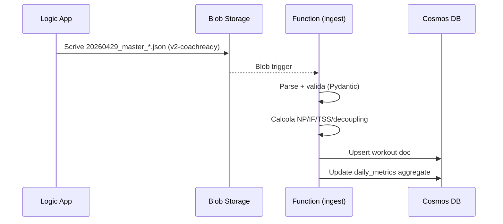
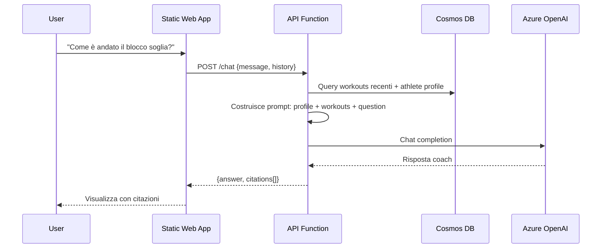

# Architettura

## Componenti

| Componente | Ruolo | Sizing consigliato | Costo stimato (EUR/mese) |
|---|---|---|---|
| Logic App (esistenti) | Ingest Strava + Intervals.icu | Consumption | ~€0 |
| Blob Storage | JSON raw e v2-coachready | LRS, Hot | < €1 |
| Function App (Python) | Ingest blob→Cosmos + API HTTP | Consumption (Y1) | < €1 |
| Cosmos DB | workouts, daily_metrics, athlete | Serverless | €1–5 |
| Azure OpenAI | LLM per il coach | gpt-4o-mini | €2–10 |
| Static Web App | Frontend | Free tier | €0 |
| Key Vault | Segreti runtime | Standard | < €0.50 |
| Application Insights | Logging/telemetria | Pay-as-you-go (basico) | < €1 |

**Totale stimato uso personale**: ~€5–15/mese.

## Flusso 1: Ingestion di un workout

## Flusso 2: Chat con il Coach AI (RAG)

## Sicurezza

- **Nessun segreto nel repo**: `.gitignore` blocca `.env`, `local.settings.json`, profili reali
- **Runtime secrets**: in Azure Key Vault, referenziati via Managed Identity
- **Auth utente**: Microsoft Entra ID su Static Web App
- **Auth tra servizi**: Managed Identity (Function → Cosmos, Function → OpenAI, Function → Blob)
- **CORS**: ristretto al dominio della Static Web App
- **Network**: per uso personale tutto pubblico con auth; eventualmente Private Endpoints in v2

## Decisioni architetturali (ADR)

### ADR-001: Perché Cosmos DB e non SQL?
- Schema-flexible (lo schema dei workout evolverà)
- Serverless con consumi ridotti
- Supporto a vector search per il RAG futuro

### ADR-002: Perché gpt-4o-mini?
- Rapporto qualità/prezzo ottimo per il task (analisi tabellare/numerica)
- Latenza bassa per UX chat fluida
- Possibilità di switchare a gpt-4o per le review settimanali "lunghe" se serve qualità extra
